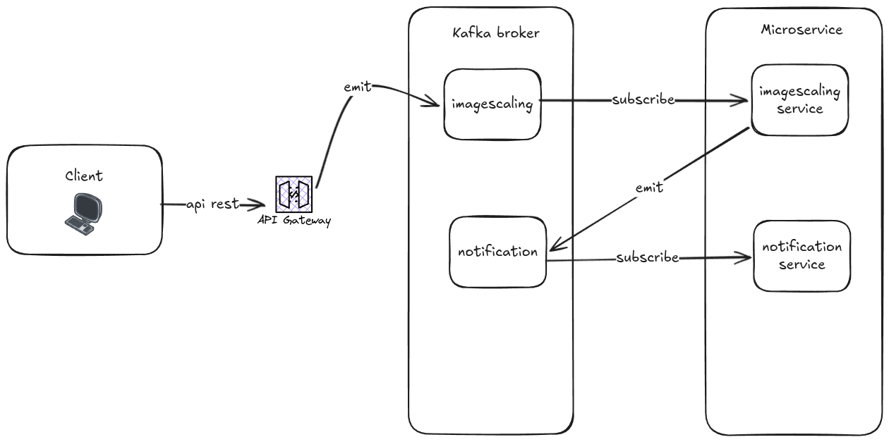

# Dimensionamento de imagem

Microserviço de dimensionamento de imagem integrado com microserviço de notificação para enviar mensagens de sucesso com a imagem dimensionada ou mensagens de erro em caso de falha. Esse projeto foi desenvolvido utilizando nestjs e kafka para comunicação entre os microserviços. O microserviço de dimensionamento de imagem recebe mensagens do tópico "images" e processa as imagens e após concluído publica mensagens no tópico "notifications" com o resultado do processamento. E o serviço de notificação consome as mensagens do tópico "notifications" e envia as notificações para os usuários. Abaixo encontra-se o diagrama de arquitetura do sistema:

